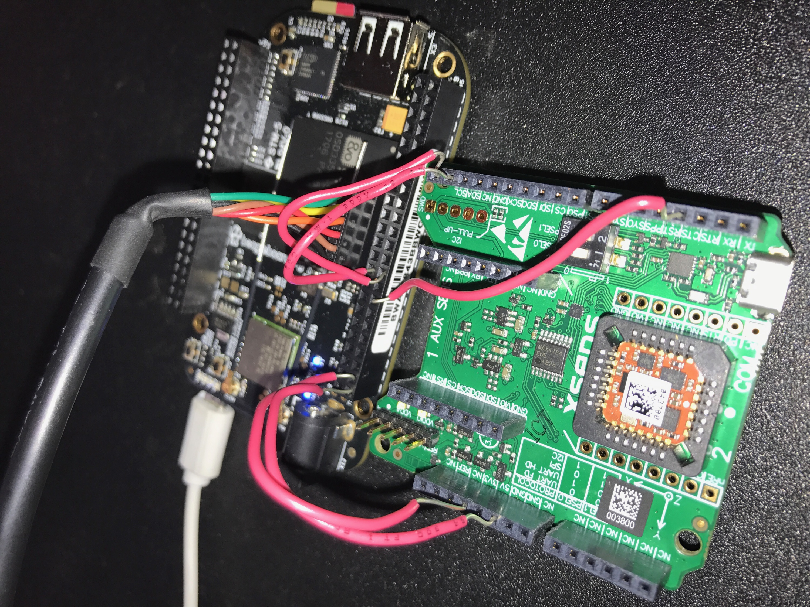

# Tomcatv2

## How to run the IMU code:

Navigate to the IMU folder
```
g++ XsensIMU.cpp XsensIMU.h imutest.cpp -o imu
```
```
./imu
```

Right now it just takes 200 measurements, writes them to telem.txt, and streams the data over UDP port 5007 on 127.0.0.1

## Wiring Setup
The following pins need to be connected: SCL, SDA, 3.3V, GND, and DRDY. DRDY should be connected to GPIO 48, which is header pin 15.



## Troubleshooting

*If you are getting IMU read errors, make sure the IMU is on and all the I2C and power pins are connected correctly.

*If the program runs but there is no telemety output and no terminal output, make sure the DRDY pin is connected to header pin 15.

*If you get GPIO read errors, make sure GPIO pin 48 is exported. If folder /sys/class/gpio/gpio48 doesn't exist, then the pin is not exported, and you can export it with:
```
cat 48 > /sys/class/gpio/export
